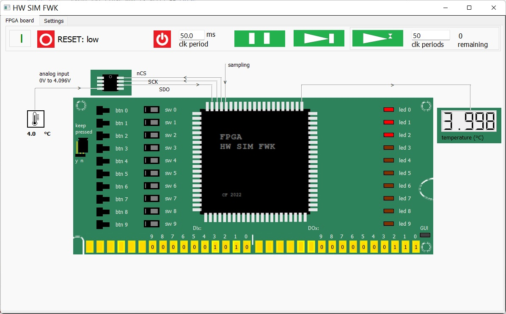

# FPGA_HW_SIM_FWK
FPGA Hardware Simulation Framework

[Article in Code Project](https://www.codeproject.com/Articles/5329919/FPGA-Hardware-Simulation-Framework-FPGA-HW-SIM-FWK "FPGA_HW_SIM_FWK Article in Code Project")

## Simulate hardware containing an FPGA programmed in VHDL interactively!

## Architecture overview

## FPGA GUI

## FPGA_HW_SIM_FWK (demo video)

[Demo Video](https://www.youtube.com/watch?v=Yqu1DDGK04c "FPGA_HW_SIM_FWK Demo Video")

## Summary
This tool provides the following features, usually not supported by standard simulation methods:
- GUI
- concurrent input / output
- interactive experience with emulated HW
  (although no "real-time" is yet supported, with simulation rates of 250Hz the stimulus and results are fast enough
   to produce a realistic HW behavior. Soon this tool will be improved to work even much faster, up to 25kHz!)
