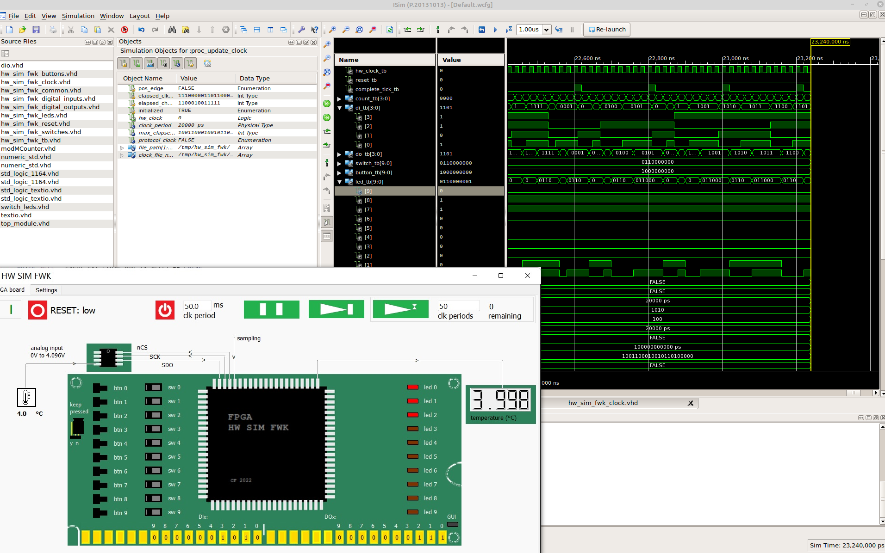
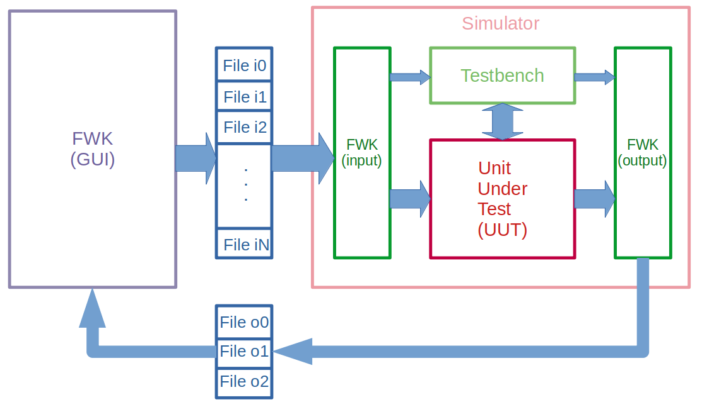

# FPGA_HW_SIM_FWK
FPGA Hardware Simulation Framework
Simulate hardware containing an FPGA programmed in VHDL interactively.

[Article in Code Project](https://www.codeproject.com/Articles/XXX "FPGA_HW_SIM_FWK Article in Code Project")

## FPGA_HW_SIM_FWK - Simulate hardware containing an FPGA programmed in VHDL interactively!

## FPGA_HW_SIM_FWK - Architecture overview

## FPGA_HW_SIM_FWK - FPGA GUI

## FPGA_HW_SIM_FWK (demo video)

[Video Playlist](https://www.youtube.com/watch?v=Yqu1DDGK04c "FPGA_HW_SIM_FWK Demo Video")
